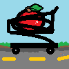

# KartApple-GL




#### Rust opengl library for creating whatever you want in opengl!

### Goals 
- Lightweight 
- Flexible for general purpose graphics
- Easy to use for beginners

```rust
impl AppScaffold for PrismGL {
    unsafe fn on_init(&mut self, app: &mut KartApple) {
        gl::Enable(gl::DEPTH_TEST);

        let vert_code = include_str!("../shaders/vert.glsl").to_string();
        let frag_code = include_str!("../shaders/frag.glsl").to_string();

        self.program = ProgramUtils::create_program(&vert_code, &frag_code);

        let mut vao = GLuint::from(1u32);
        gl::GenVertexArrays(1, &mut vao);
        gl::BindVertexArray(vao);
        self.vao = vao;
        let side_length = 0.75f32;

        //...
    } 
}
```

## Requirements

- must have cmake installed for glfw
```bash
sudo apt install cmake
```
```bash
choco install cmake
```

## Quick Start

- implement the Scaffold trait and pass it in as an argument to KartApple.start


